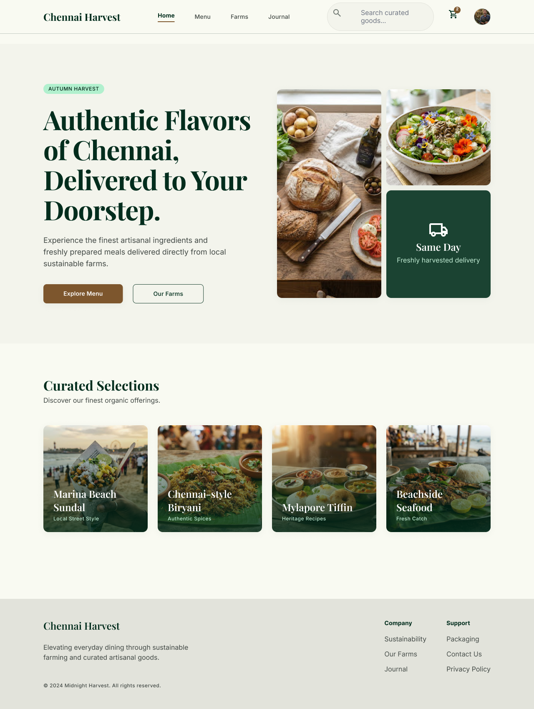
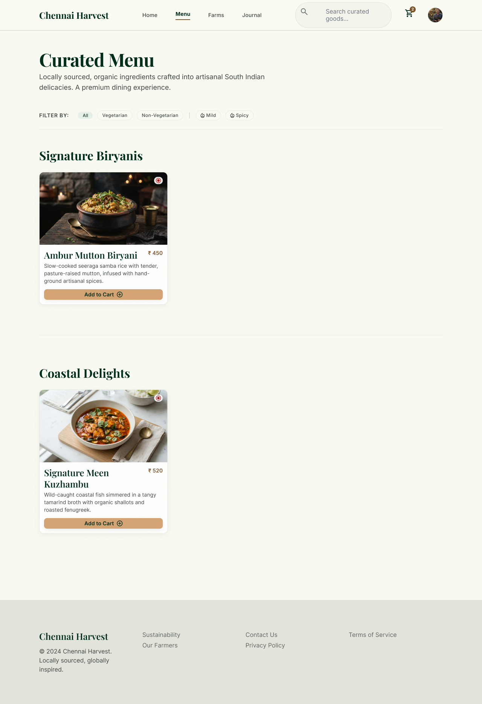
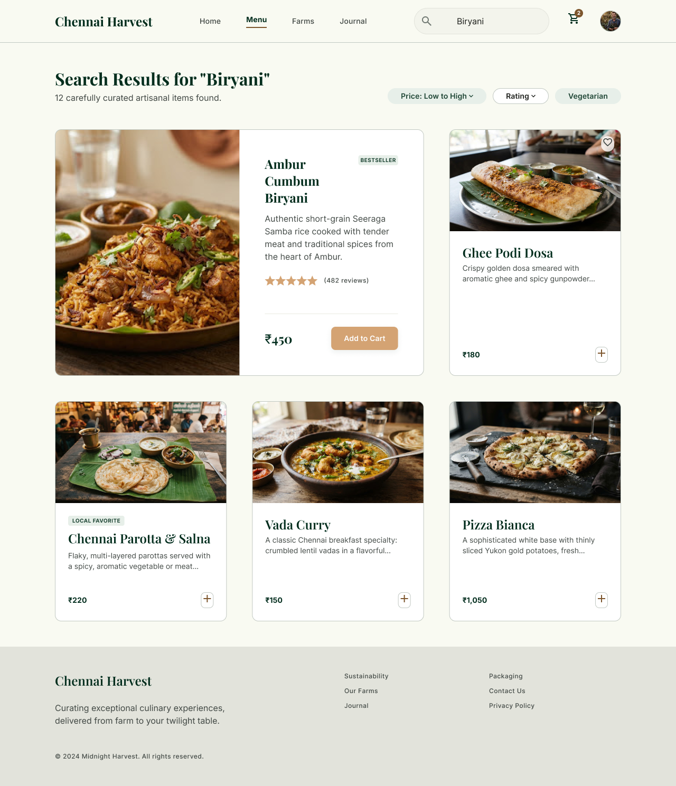
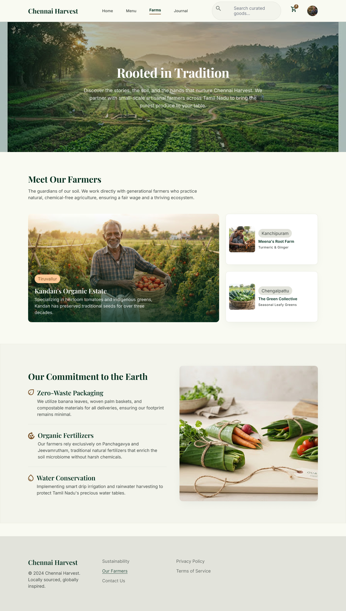
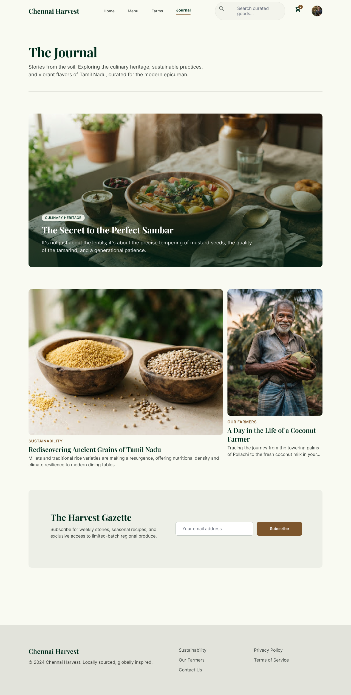
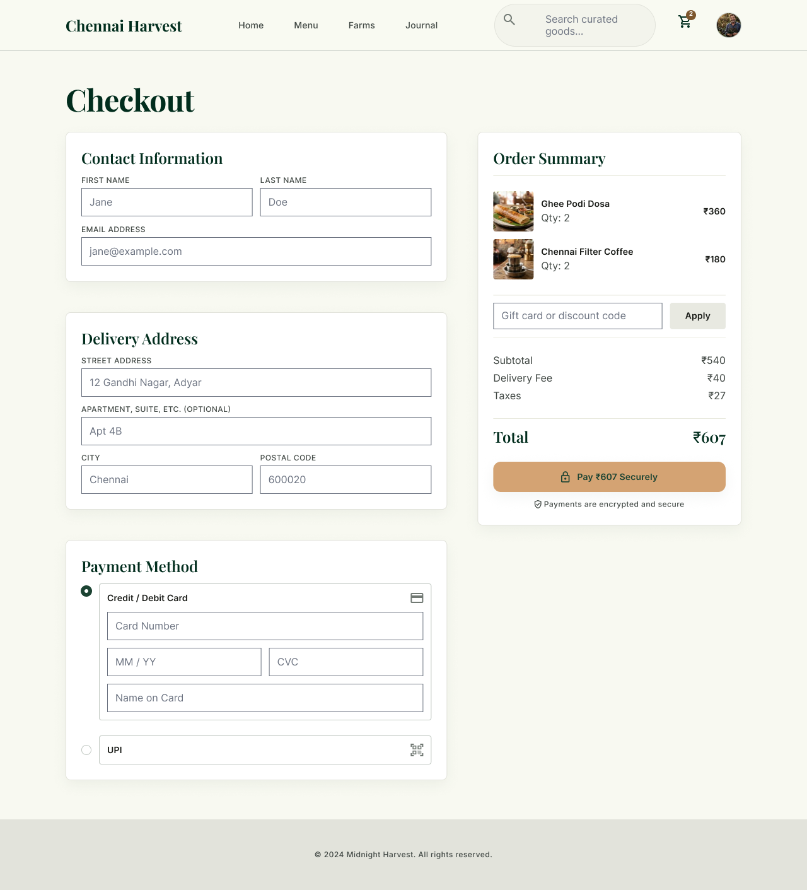

# Interaction Design System

A UI/UX design project — a Figma file and page previews — created during my **UI/UX Design internship** at **Codtech IT Solutions Pvt. Ltd.**

## Internship Details

- **Organization:** Codtech IT Solutions Private Limited
- **Role:** UI/UX Design Intern
- **Intern ID:** CITS7653

## About

This repository holds the Figma source file (`Interaction_Design_System.fig`) along with page preview screenshots, designed for **Chennai Harvest** — a concept food delivery website featuring a homepage, curated menu, search results, farms page, journal, and checkout flow.

## Design Previews

### Home

### Menu

### Search Results

### Our Farms

### Journal

### Checkout

## Files

- `Interaction_Design_System.fig` — Original Figma project file. Open it with [Figma](https://www.figma.com) to view or edit.
- `designs/` — PNG previews of each page in the design.

## How to open the Figma file

1. Download `Interaction_Design_System.fig` from this repository.
2. Go to [figma.com](https://www.figma.com) and log in (or create a free account).
3. Click **Import** and select the downloaded `.fig` file.
